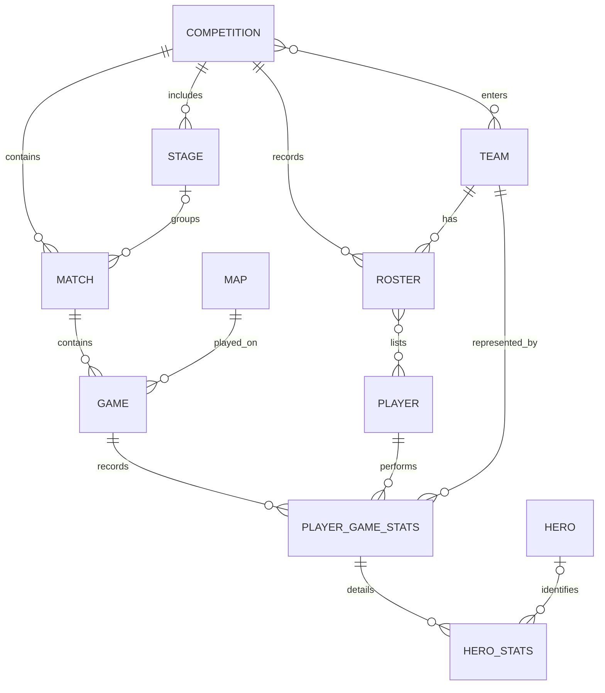

# OWCS 对外赛事数据 API

版本：`1.0.0`。更新日期：2026-09-09。

本文是合作方可阅读的契约。生产基础地址：`https://stats.owmini.xyz/data/v1`。该前缀独立于现有接口，公开读取无需登录。发布验收覆盖真实 HTTP 响应、契约校验与原始数据核对。

## 1. 服务定位

提供赛事目录、参赛关系、比赛结果、地图局、选手和英雄统计，以及近期赛程提示。合作方自行决定如何展示、计算或用于 AI 问答。

只公开明确列入 [OpenAPI](openapi.yaml) 的字段。成功正文只包含赛事数据、覆盖信息，以及必要的分页或赛程时效信息。请求追踪和 HTTP 缓存信息放在响应头。

不公开系统配置、采集任务、同步队列、内部来源标识、人工审核记录、投票或访客数据。该版本不提供 SQL 执行、AI 问答、预测或解释性排名接口。

## 2. 资源关系



- **Competition（赛事）**：一个独立收录条目，例如“2026 OWCS 国服赛区第二阶段”。不自动拆成年份、赛区或整届巡回赛。名称相似的不同条目不自动合并。
- **Stage（阶段）**：某赛事内部的常规赛、季后赛等分段。比赛的 `stage` 可以为 `null`。
- **Roster（名单）**：某赛事某队的选手归属关系。名单不等于某场首发，也不证明当前仍在队。
- **Match（比赛）**：一场系列赛，含双方、大场比分、胜方、日期和 BO 赛制。
- **Game（地图局）**：系列赛中实际收录的一张地图局。同一地图重复出现时仍是不同 Game。
- **PlayerGameStats**：某地图局中某队某选手的统计，唯一键为 `(game_id, team.id, player.id)`。
- **HeroStats**：该条选手地图统计下的英雄使用明细。它不构成独立的整局记分板。

近期赛程 `/schedule` 是独立的外部赛程提示集合，可能包含尚未进入赛事结果库的赛事或队伍，不强行创建或匹配本地实体。

## 3. 接口目录

以下路径均相对于 `/data/v1`，只接受 `GET` / `HEAD`。公开读取无需 API Key。

| 分类 | 路径 | 返回内容 |
|---|---|---|
| 赛事 | `/competitions` | 赛事目录，支持名称、状态筛选与分页 |
| 赛事 | `/competitions/{competition_id}` | 一个赛事 |
| 赛事 | `/competitions/{competition_id}/stages` | 该赛事全部内部阶段 |
| 名单 | `/competitions/{competition_id}/teams` | 该赛事参赛队伍，分页 |
| 名单 | `/competitions/{competition_id}/teams/{team_id}/players` | 该赛事该队的完整名单 |
| 覆盖 | `/competitions/{competition_id}/coverage` | 已收录比赛、时长、选手与英雄统计覆盖 |
| 目录 | `/teams`、`/teams/{team_id}` | 队伍与已确认别名 |
| 目录 | `/players`、`/players/{player_id}` | 选手及目录位置 |
| 目录 | `/maps`、`/maps/{map_id}` | 地图与模式 |
| 目录 | `/heroes`、`/heroes/{hero_id}` | 英雄与职责分类 |
| 比赛 | `/matches`、`/matches/{match_id}` | 系列赛列表或一场系列赛 |
| 地图局 | `/matches/{match_id}/games` | 该场全部已收录地图局 |
| 地图局 | `/matches/{match_id}/games/{game_id}` | 一张地图局 |
| 统计 | `/matches/{match_id}/games/{game_id}/player-stats` | 该地图局的选手统计，每行内含英雄明细 |
| 数据包 | `/matches/{match_id}/data` | 该场全部已收录地图、选手和英雄统计，一次完整返回 |
| 赛程 | `/schedule` | 当前来源范围内的近期赛程提示 |

共 21 个路径。完整参数、Schema、状态码及 HEAD 定义以 [openapi.yaml](openapi.yaml) 为准。

### 3.1 比赛筛选

`/matches` 支持：`competition_id`、`stage_id`、`team_id`、`opponent_id`、`player_id`、`map_id`、`date_from`、`date_to`。

- 所有已提供条件取交集。
- `stage_id` 必须同时提供 `competition_id`，阶段必须属于该赛事。
- `opponent_id` 必须与不同的 `team_id` 同时提供，两队侧位可交换。
- `player_id` 依据实际地图统计判断登场，不依据名单。
- `player_id` 与 `team_id` 同用，表示该选手代表该队出场；与 `map_id` 同用，表示在该地图出场。三者同用时必须由同一条选手地图统计满足。
- `map_id` 使用存在性筛选，同一比赛打两次该地图也只返回一场。
- 日期边界均包含当天。`date_from` 不得晚于 `date_to`。

### 3.2 目录检索

目录的 `q` 按“名称包含查询串”检索，忽略大小写并规范空白；`%` 和 `_` 为普通字符，不作为通配符；规范后为空的查询无效。队伍同时匹配已确认别名。返回结果以 ID 区分，不把同名选手合并为同一人。

`/players` 可按 `competition_id`、`team_id`、`role` 过滤。前两个条件是名单归属，不是“实际出场”或“现在效力”；同时提供时必须在同一赛事队伍关系内满足。

## 4. 响应、分页与错误

单资源响应：

```json
{"data":{"id":24,"name":"2026 守望先锋世界杯 小组赛","status":"completed"}}
```

分页集合：

```json
{"data":[],"pagination":{"next_cursor":null}}
```

- `limit` 默认 50，范围 1–100。只用于 OpenAPI 声明可分页的集合。
- 客户端原样传递 `next_cursor`，并保持筛选条件与 `limit` 不变。`null` 表示本次遍历结束。
- 一次遍历的游标在首次读取后 24–48 小时内到期，后续翻页不延长有效期。过期返回 410；无效或与筛选条件不匹配返回 400。
- 基础目录和参赛队伍按 ID 升序；比赛按日期降序、ID 降序。分页实现采用键集游标，避免名称变化或新记录插入引起 offset 位移。
- 游标是翻页工具，不是增量更新凭证，也不是跨请求的一致性快照。并发更正、删除可能改变遍历结果。
- 阶段、名单、比赛地图局、地图选手统计和单场数据包完整返回，不静默截断。
- 子资源必须归属于路径指定父资源。父子不匹配返回 404。
- 有效集合无数据返回 200 和空数组；不存在的实体返回 404。两者不可混用。
- 无效/重复单值参数、未知参数、错误日期、超出范围的 `limit`、条件组合错误返回 400。

统一错误：

```json
{"error":{"code":"NOT_FOUND","message":"Requested resource was not found."}}
```

| 状态 | 处理 |
|---|---|
| 304 | 表示未变化，无正文，使用已有缓存 |
| 400 | 修正参数，勿原样反复重试 |
| 404 | 检查 ID、父子关系或参赛关系 |
| 405 | 改用 GET/HEAD |
| 410 | 游标过期，从第一页重新读取 |
| 429 | 按 `Retry-After` 等待后重试 |
| 503 | 当前不能提供满足契约的数据；可退避重试，不解释成“零场比赛” |
| 500 | 记录 `X-Request-Id` 供排障，不将错误当作赛事事实 |

HEAD 校验相同参数，只返回对应 GET 的响应头与状态，不返回正文。
路径区分大小写，不接受尾部多余 `/`。当前每个服务实例对单个调用 IP 最多接受 240 次读取/分钟；429 的 `Retry-After` 是客户端退避依据，限额不能跨实例相加后视为配额承诺。
405 必须附带 `Allow: GET, HEAD`。本版首先面向合作方服务端调用；若需要浏览器跨域直连，在部署层另行配置 CORS 与预检，不把浏览器预检当成赛事写入能力。

## 5. 数据边界与缺失

所有属性都按 Schema 返回，缺失值显式为 `null`；不靠省略字段表示缺失。

- 数值 `0`：有效来源记录中的真实零；`null`：没有可用证据提供该值。
- `stage=null`：未配置或无法确认阶段，不自动设为常规赛。
- `number=null`：没有可靠地图局序号；不能把数据库 ID 排序解释为比赛顺序。
- `duration_seconds=null`：时长未采集或无效；不能用它作除数。
- `banned_hero=null`：缺少 Ban 记录；不能解释成没有禁用英雄。
- `hero_stats.status=not_recorded` 且 `items=[]`：没有可用英雄明细，不等于没使用英雄。
- `hero_stats.status=recorded`：存在可用明细，不保证包含短时英雄或覆盖全部时间。
- 未知英雄可保留名称，`hero.id=null`；不强行映射相似名称。

单场数据包另有 `result_consistency`：对已记录系列赛比分和地图胜方数量做一致性比较。`consistent` 表示双方数量一致且所有已收录地图都有胜方；任一队已记录胜图数超出其大场比分则为 `conflicting`；信息不足时为 `insufficient_data`。它不证明官方数据全集完整。发现冲突时保留两层原始结果，不擅自改分或选择某层覆盖另一层。

`player_stats_coverage` 只验证本版标准 5v5 的记录结构：双方各五名有效、唯一的选手统计为 `recorded`；有记录但不完整为 `partial`；没有记录为 `not_recorded`。不由名单补造缺失选手。

`/coverage` 的计数只针对已收录范围。`recorded_games + partial_games + missing_games = games`，时长有/无记录计数之和也等于 `games`。这些计数不表示官方比赛全集已完整收录。

## 6. 时效与合作方缓存

普通赛事接口读取已提交的赛事数据。API 无法早于上游采集和同步提供数据。

- `ETag` 描述本次公开响应表示，`If-None-Match` 用于条件读取。
- 普通接口使用 `Cache-Control: public, max-age=0, must-revalidate`。缓存复用前验证，内容变化后重新取数。
- `ETag` 必须涵盖响应涉及的全部公开字段和子资源。不能只根据父比赛更新时间生成。
- HTTP `Date` 是响应时间，不是比赛数据发布时间；本版不返回无法可靠计算的全库更新时间或承诺秒级更新。
- `/schedule` 额外返回 `freshness.observed_at` 和 `freshness.stale`。前者是最后一次成功读取赛程来源的时间；来源异常时可返回旧数据，但必须明确 `stale=true`。没有成功缓存时返回 503。
- `/matches/{id}/data` 必须在单个只读一致性快照内生成；它保证一场数据包内部一致，不保证与另一次请求或整个数据集处于同一时刻。

本版没有完整数据快照与变更流，不宣称支持可靠增量同步。需要长期镜像的合作方，先使用单场数据包加周期性全量核对；未来另行提供带删除记录、恢复游标和一致性检查点的交付协议。详见 [接入说明](integration.md)。

## 7. 版本与兼容

- 主版本位于路径中。对外赛事数据统一使用 `/data/v1`；旧 `/agent/v1` 已从当前代码移除，没有兼容转发，旧调用方需按本契约迁移。生产状态以部署验收结果为准。
- 删除字段、改变单位/语义/标识方式、收窄可用值或使旧客户端无法处理的枚举扩展，必须发布新主版本。
- 公开字段采用显式白名单。运行时不序列化完整 ORM 对象或上游对象。
- 同一主版本可经评审增加可选资源或字段。调用方应能忽略新字段；当前 OpenAPI 使用封闭对象约束本版生产者，双方同步更新契约后才能发布新增字段。
- 不同环境的 ID 不要求一致；名称变更不应改变同一数据集内的实体 ID。显式删除或身份纠正会改变记录集合，不能假定删除后重建仍是原对象。

## 8. 配套文件

- [OpenAPI 3.1.1](openapi.yaml)：机器可读契约。
- [数据字典](data-dictionary.md)：字段含义与计算边界。
- [合作方接入说明](integration.md)：查询、缓存和落库方法。
- [示例说明](examples/README.md)：真实样本投影与合成边界样例。
- [校验脚本](validate.py)：OpenAPI、样例、公开字段和关系约束校验。

文档校验可在独立 Python 环境中执行（依赖清单为 `requirements-validation.txt`）：

```sh
python -m pip install -r docs/public-data-api/requirements-validation.txt
python docs/public-data-api/validate.py
```

校验脚本不连接数据库或网络。实现测试可以将实际 HTTP 响应保存为 JSON，再使用 `python docs/public-data-api/validate.py --responses <响应文件>` 验证所有 42 个 GET/HEAD 操作的正文与响应头；该结果不证明生产服务已部署。

规范参考：[OpenAPI 3.1.1](https://spec.openapis.org/oas/v3.1.1.html)、[HTTP Semantics / RFC 9110](https://www.rfc-editor.org/rfc/rfc9110.html)。
